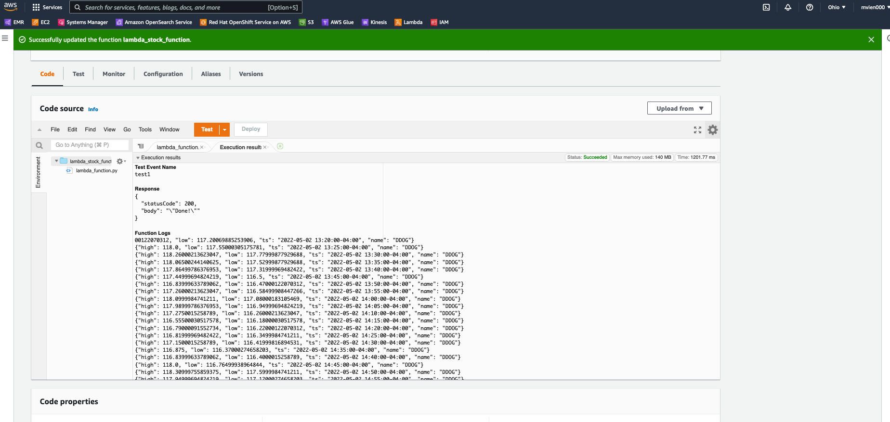
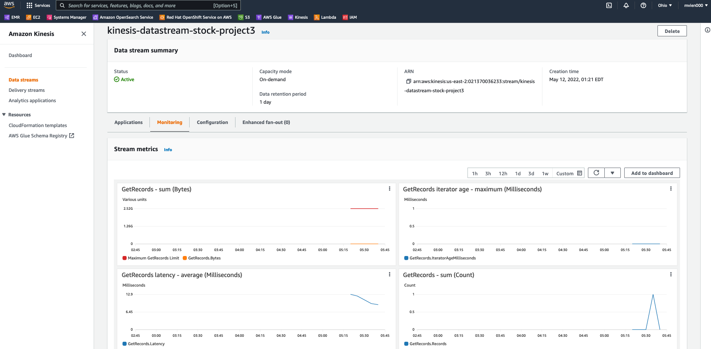
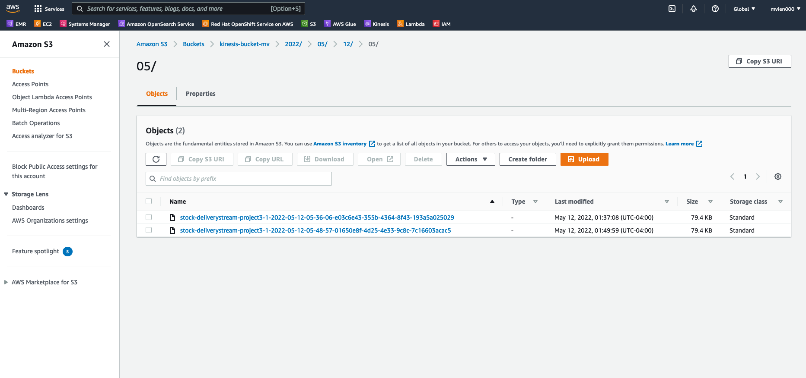

# Streaming Finance Data with AWS Lambda
- Technology: AWS Lambda, Kinesis, S3, AWS Glue, Athena
- Language: Python, SQL
- [Code](data_transformer.py)
- [Analysis](Analysis.ipynb)

## Project Description

Lambda function, Kinesis are implemented to stream Yahoo Finance stock price data in json format and stored inside S3 bucket. 
A lambda function will be trigger every 1 to 5 minutes to collect stock data and deliver it to S3 via Kinesis delivery stream.
In addition, we use AWS Glue to discover and connect our data in S3 bucket to AWS Athena for performing query using SQL language.

The notebook contains four parts.

- 1)	Highest Stock Price at the First Trading Hour
- 2)	Highest Hourly Stock Price Trend
- 3)	Comparison of Opening and Closing Price 
- 4)	Average Highest Hourly Stock Price 

## Execution Results

## Kinesis Configuration

## S3 Bucket

